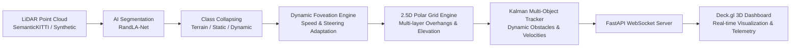

# FoveaMap: 2.5D LiDAR Perception & Mapping Pipeline

FoveaMap is a high-performance, real-time 2.5D LiDAR perception and mapping system designed for autonomous vehicles and robotics. It solves the massive memory and computational bottlenecks of traditional dense 3D voxel grids by intelligently compressing 3D LiDAR point clouds into a **kinematically-adaptive, multi-resolution 2.5D polar grid**.

This repository contains the complete end-to-end pipeline: from raw point cloud ingestion and deep learning segmentation to dynamic foveation, tracking, and a real-time 3D web dashboard.

---

## 🌟 Key Features

1. **Extreme Memory Efficiency (85–90% Savings)**
   Instead of storing billions of empty 3D voxels, FoveaMap uses a sparse 2.5D polar coordinate grid. It maps the environment into concentric range rings and azimuth slices.
2. **Multi-Layer 2.5D Elevation Profile**
   Captures drivable ground level ($z_{\text{ground}}$) as well as overhead clearance limits ($z_{\text{obstacle\_bottom}}$, $z_{\text{obstacle\_top}}$) to represent complex structures like bridges, tunnels, and tree canopies in a 2.5D format.
3. **Kinematic Dynamic Foveation**
   Inspired by human vision, the high-resolution perception zone adapts to the vehicle's state:
   - **Speed Stretch**: Elongates the high-resolution zone forward as the vehicle drives faster.
   - **Steering Shear**: Bends the high-resolution field of view into oncoming turns.
4. **AI Semantic Segmentation**
   Integrates **RandLA-Net** (via Open3D-ML) to classify 3D LiDAR points. A dynamic config-driven mapper collapses SemanticKITTI's 30+ raw classes into a streamlined 4-class taxonomy (Terrain, Static Obstacles, Dynamic Obstacles, Ignored).
5. **Multi-Object Kalman Tracking & Anti-Ghosting**
   Tracks moving objects (vehicles, pedestrians) using a 2D constant-velocity Kalman filter. Automatically prunes stale tracks and actively erases "ghost" footprint trails left behind by moving dynamic objects.
6. **Real-Time Streaming API & 3D Dashboard**
   A non-blocking **FastAPI** backend streams telemetry, active tracks, and grid geometry over WebSockets to a stunning **deck.gl** 3D web dashboard at up to 30 FPS.

---

## 🏗️ System Architecture



### Module Breakdown
- `src/ingestion/`: Handles data loading (SemanticKITTI `.bin`/`.label` files) and procedural synthetic scene generation for testing.
- `src/perception/`: Handles AI inference (RandLA-Net) and semantic class mapping.
- `src/grid/`: Contains the core `PolarGridEngine` and kinematic `foveation` mathematics.
- `src/tracking/`: Implements the `KalmanTrackerManager` and active footprint erasure logic.
- `src/api/`: Asynchronous FastAPI backend providing REST endpoints and WebSocket streaming.
- `src/metrics/`: Evaluation utilities (Mean IoU, distance-bucketed accuracy, latency profiling).
- `dashboard/`: React + Vite + deck.gl frontend client.

---

## 🚀 Getting Started

### Prerequisites
- Python 3.9+
- Node.js (for frontend modifications, if needed)

### Installation

1. **Clone the repository:**
   ```bash
   git clone <repository_url>
   cd lidar-2.5D-mapping-main
   ```

2. **Install Python dependencies:**
   ```bash
   pip install -r requirements.txt
   ```
   *(Note: For full RandLA-Net segmentation capabilities, ensure `open3d-ml` and `torch` are properly installed for your CUDA version).*

### Running the Application

To launch the backend server, precompute missing synthetic scenarios, and serve the real-time 3D dashboard:

```bash
python run_demo.py
```

This command will:
1. Detect and stream from the genuine physical KITTI Odometry Velodyne dataset (`data_odometry_velodyne.zip` or extracted sequences), with fallback to procedural data if absent.
2. Precompute scenario frames if needed.
3. Launch the FastAPI server.
4. Open your default web browser to the FoveaMap Dashboard.

**Important Endpoints:**
- **Dashboard UI**: [http://localhost:8080/](http://localhost:8080/)
- **WebSocket Stream**: `ws://localhost:8080/ws/grid`
- **Health Check**: `http://localhost:8080/health`

*(Note: The server has been configured to serve the `dashboard/` directory directly as static files, allowing you to run the entire stack from a single command without needing a separate Node dev server).*

---

## 🧪 Testing

The codebase includes an extensive suite of `pytest` unit tests verifying resolution logic, grid memory savings, dynamic foveation mathematics, and Kalman tracking.

Run all tests from the repository root:
```bash
python -m pytest tests/ -v
```

---

## ⚠️ Known Limitations
- **Multi-Story Structures**: The 2.5D grid engine is limited to one ground plane and one elevated bounding volume per polar cell. Extremely complex multi-story overlapping geometry (e.g., parking garages) cannot be fully represented without a full 3D voxel grid.
- **Occlusion**: Objects fully occluded from the ego-vehicle's line of sight are not reconstructed.
- **AI Generalization**: The provided lightweight AI checkpoints may overfit to specific procedural synthetic data or the SemanticKITTI domain without further diverse training data. The heuristic RANSAC fallback is provided for robust geometric segmentation when AI confidence is low.
