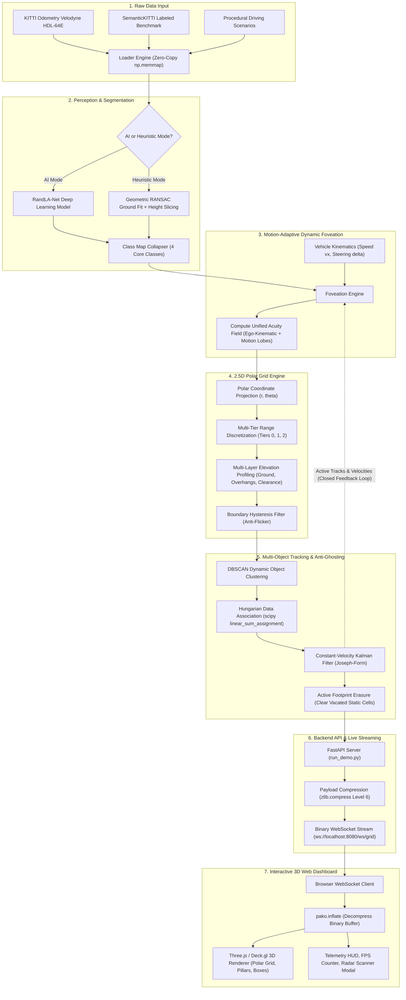
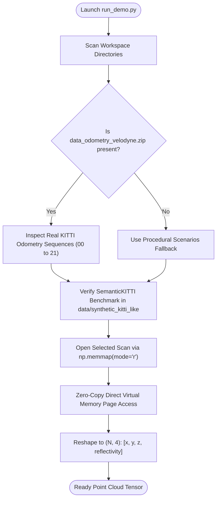
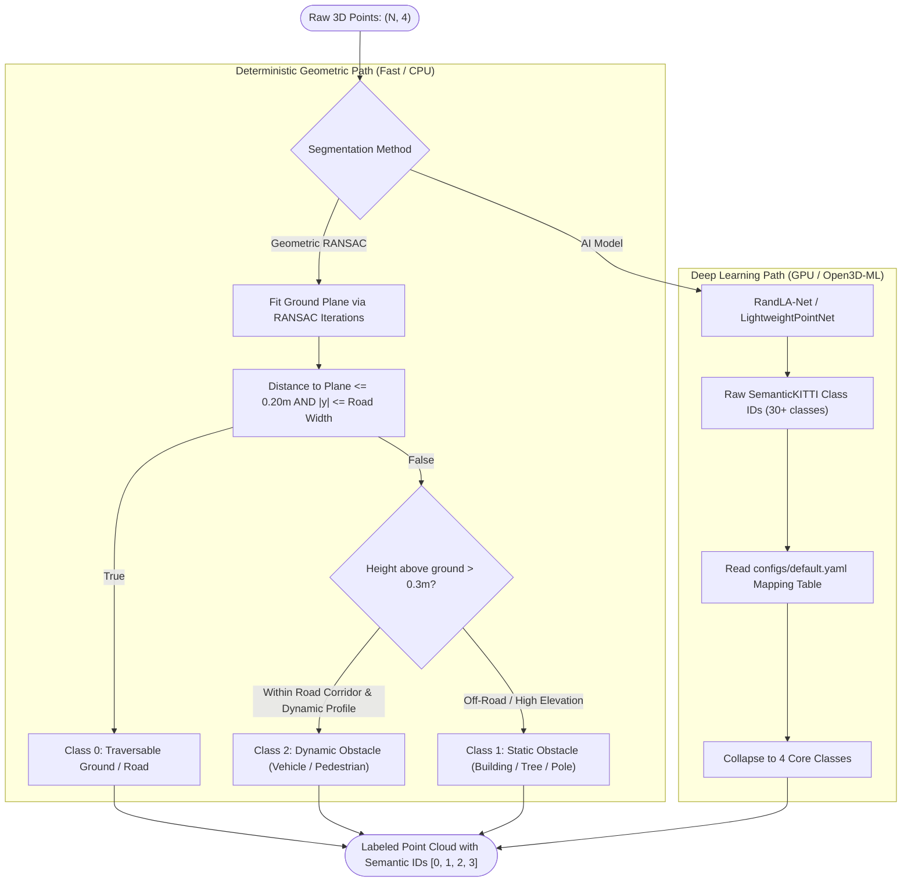
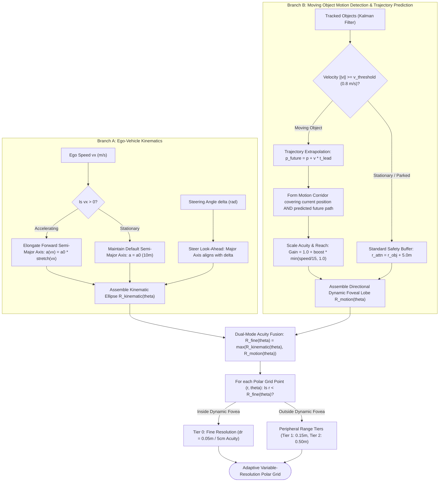
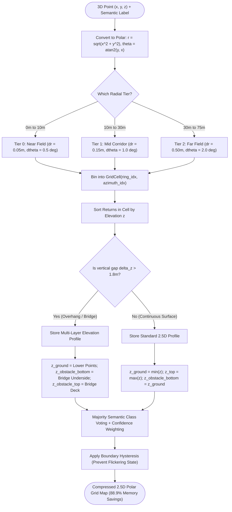
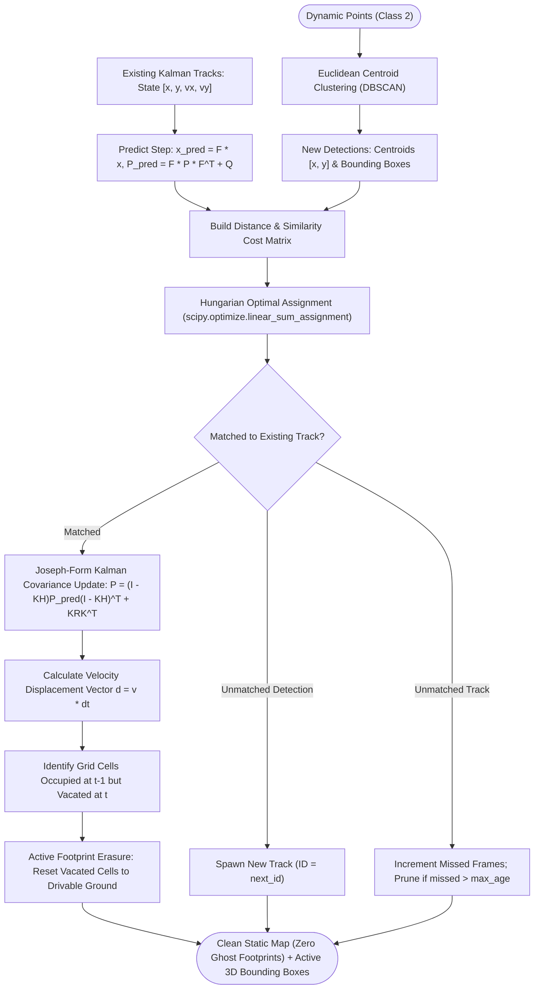
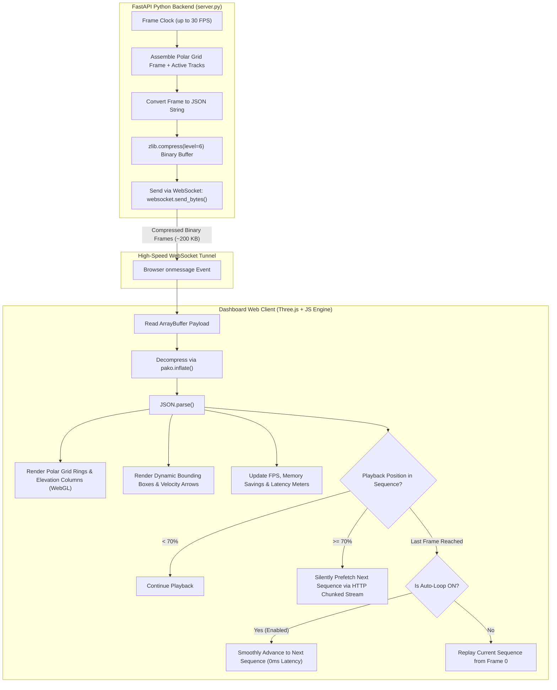

# FoveaMap: Architecture & Pipeline Flowcharts

A comprehensive visual guide to the **FoveaMap** 2.5D LiDAR perception and mapping system. These flowcharts illustrate how raw 3D laser points transform into an adaptive, memory-efficient 2.5D elevation grid with real-time tracking and 3D web streaming.

---

## 1. High-Level System Architecture

This master diagram shows the end-to-end flow from physical sensors/datasets to the user's interactive 3D browser screen.

---

## 2. Point Cloud Ingestion & Dataset Selection

How FoveaMap discovers, verifies, and memory-maps point cloud datasets without blocking CPU execution.

### Simple Explanation:
1. **Auto-Discovery**: The launcher checks if the full KITTI Velodyne odometry dataset (sequences 00–21) is available.
2. **Zero-Copy Memory Mapping**: Instead of reading whole files into RAM, it uses operating system page caching (`np.memmap`), enabling instant scan loading without disk lag.
3. **Dual Dataset Operation**: Real physical sensor scans and ground-truth benchmark sequences coexist seamlessly.

---

## 3. Perception & Semantic Segmentation Pipeline

How 3D laser points are classified into drivable roads, static obstacles, and moving traffic.

### Simple Explanation:
- **Heuristic RANSAC**: Highly robust fallback that calculates the road plane mathematically. Anything near the plane is drivable ground; elevated objects inside driving corridors are flagged as vehicles or pedestrians.
- **Deep Learning (RandLA-Net)**: Uses neural networks to classify every point.
- **Class Map Collapsing**: Condenses 30+ messy raw classes into 4 actionable categories:
  - **Class 0**: Drivable Terrain
  - **Class 1**: Static Structures
  - **Class 2**: Dynamic Moving Obstacles
  - **Class 3**: Free Space / Ignored

---

## 4. Motion-Adaptive Dynamic Foveation Mechanics

How the system dynamically adjusts its high-resolution perception zone in real time by fusing **Ego-Kinematic Stretch** with **Moving Object Trajectory Look-Ahead**.

### Motion-Adaptive Foveation Explained:
- **Ego-Kinematic Foveation**: As the ego vehicle accelerates down a highway, the forward foveal zone elongates ahead ($v_{\text{ref}} = 20\text{ m/s}$, up to $2.5\times$ stretch). Turning the wheel bends the ellipse into the turn.
- **Motion Detection & Filtering**: Rather than treating stationary parked cars as dynamic threats, the tracker estimates velocity vectors ($\vec{v} = (v_x, v_y)$). Only obstacles moving above the threshold ($v \ge 0.8\text{ m/s}$) trigger active motion foveation.
- **Predictive Trajectory Corridor**: For moving vehicles, crossing pedestrians, and cyclists, the foveation engine calculates look-ahead positions ($\vec{p}_{\text{future}} = \vec{p} + \vec{v} \cdot \Delta t_{\text{lead}}$). Dynamic foveal lobes stretch ahead of the obstacle along its direction of motion.
- **High-Acuity Allocation**: Points on and ahead of the moving object are allocated into Tier 0 ($5\text{cm}$ grid cells), ensuring high-density geometric capture for collision prevention regardless of their azimuth relative to the car.

---

## 5. 2.5D Polar Grid & Multi-Layer Elevation Engine

How 3D point clouds are compressed into a multi-layer polar grid, capturing clearance under bridges and tunnels.

### Simple Explanation:
- **Polar Rings**: Matches how LiDAR spins. Fine rings close to the car; wider rings farther away.
- **Multi-Layer Elevation**: If a bridge is overhead, a normal 2D map marks it as a solid wall. FoveaMap detects the empty vertical gap between the road ($z_{\text{ground}}$) and the bridge underside ($z_{\text{obstacle\_bottom}}$), recognizing the road is drivable underneath.

---

## 6. Multi-Object Kalman Tracking & Anti-Ghosting Erasure

How moving vehicles and pedestrians are tracked without leaving lingering ghost footprints on the static map.

### Simple Explanation:
- **Hungarian Matching**: Ensures two crossing vehicles do not swap IDs.
- **Joseph-Form Kalman Filter**: Mathematically guarantees stable velocity tracking without numerical errors.
- **Active Footprint Erasure (Anti-Ghosting)**: Moving trucks leave behind empty space where they used to be. The tracker clears those cells immediately so the car does not brake for "ghost" obstacles.

---

## 7. Real-Time Streaming & Dashboard Playback Architecture

How the FastAPI backend compresses data and streams it to the web browser with zero-lag background prefetching.

### Simple Explanation:
1. **Binary Compression (`zlib` + `pako`)**: Shrinks frame data by ~88%, keeping streams fast even on slow connections.
2. **WebGL Rendering**: Three.js draws the polar grid, 3D elevation pillars, and dynamic tracking boxes.
3. **Background Prefetching**: When a sequence is 70% finished, the browser fetches the next one in the background, allowing seamless continuous auto-looping without buffering delays.

---

## 8. Summary Table of Pipeline Components

| Pipeline Stage | Primary File | Key Input | Key Output | Performance Metric |
| :--- | :--- | :--- | :--- | :--- |
| **Ingestion** | [`kitti_loader.py`](file:///c:/Users/kaush/Downloads/lidar-2.5D-mapping-main/src/ingestion/kitti_loader.py) | `.bin` Velodyne scans | `(N, 4)` NumPy array | Zero-copy page cached read |
| **Perception** | [`heuristic_fallback.py`](file:///c:/Users/kaush/Downloads/lidar-2.5D-mapping-main/src/perception/heuristic_fallback.py) / [`segment.py`](file:///c:/Users/kaush/Downloads/lidar-2.5D-mapping-main/src/perception/segment.py) | `(N, 4)` point array | Semantic class IDs `[0, 1, 2, 3]` | mIoU $\ge 0.4238$ |
| **Foveation** | [`foveation.py`](file:///c:/Users/kaush/Downloads/lidar-2.5D-mapping-main/src/grid/foveation.py) | Vehicle $v_x$, $\delta$ | Fovea ellipse parameters | Dynamic speed stretch & look-ahead shear |
| **Grid Engine** | [`grid_engine.py`](file:///c:/Users/kaush/Downloads/lidar-2.5D-mapping-main/src/grid/grid_engine.py) | Points + Labels | `GridCell` dictionary | **88.9% memory savings** vs 3D voxels |
| **Tracking** | [`kalman_tracker.py`](file:///c:/Users/kaush/Downloads/lidar-2.5D-mapping-main/src/tracking/kalman_tracker.py) | Dynamic clusters | Filtered tracks + cleared footprints | Hungarian association + anti-ghosting |
| **Streaming** | [`server.py`](file:///c:/Users/kaush/Downloads/lidar-2.5D-mapping-main/src/api/server.py) | Frame dictionary | Binary WebSocket frames | 88.2% bandwidth compression ratio |
| **Dashboard** | [`dashboard/js/app.js`](file:///c:/Users/kaush/Downloads/lidar-2.5D-mapping-main/dashboard/js/app.js) | Binary frames | Interactive 3D WebGL visualization | Smooth 30 FPS playback & continuous auto-loop |
